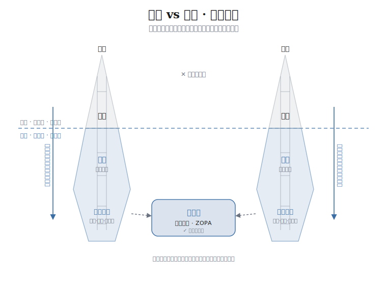

<div align="center">

# 哈佛谈判术.skill

> *「输的人一开口就报价，赢的人一开口先提问。」*

[](LICENSE)
[](https://agentskills.io)
[](#安装)

<br>

**把价值数万美金的哈佛谈判训练营，变成一位随叫随到、会分步追问的谈判教练。**

<sub>基于开放的 [Agent Skills 协议](https://agentskills.io)，可在 Claude 桌面端、Claude Code、Cursor、Codex 等兼容 runtime 中运行。</sub>

<br>

它不替你拍板，而是用**苏格拉底式分步提问**帮你想清处境，<br>
再**一步步引导**你制定出可执行的谈判策略——<br>
买房砍价、谈薪、离职补偿、离婚协议、商业合同，同一套方法全打通。

[看效果](#效果示例) · [安装](#安装) · [核心模型](#核心模型立场-利益冰山) · [它怎么工作](#它怎么工作六步引导) · [适用场景](#适用场景)

</div>

---

## 效果示例

```
你       ❯ 下周和公司谈离职补偿，他们大概只想给 N，我想多要，怎么准备？

教练     ❯ 先别急着想话术。我问你三件事，想清楚你就赢了一半：

            1. 你"真正"要的是钱，还是钱 + 干净的离职证明 + 时间？
            2. 如果这次谈崩，你下一步最现实的选择是什么？
               —— 这是你的 BATNA，也是你真正的底气。
            3. 对方为什么愿意谈：怕你闹、怕仲裁、还是赶时间清人？

            谁更需要这笔交易，谁就握着方向盘。
            先回答我，我再带你把要价、客观依据和让步节奏一步步定下来。
```

```
你       ❯ 看中一套房挂牌 500 万，中介说房东很坚定不让价，怎么砍？

教练     ❯ "房东很坚定"是中介的话术，先别信。你缺的不是砍价勇气，是依据。
            三个问题：
            1. 同小区、同户型最近半年成交价多少？（这是你的客观标准）
            2. 这套房挂了多久、降过价没有？房东为什么卖、急不急？
            3. 你还有别的备选房源吗？（没有，你就先去看几套）

            找到"实际成交普遍比挂牌低 8%"这种硬依据，你的开价就不再是
            "我觉得贵"，而是"参考 XX 的成交价，我出 XX 万"。
            让数字替你砍价，比你跟中介斗狠管用得多。
```

```
你       ❯ 房东要涨租 15%，不答应就让我搬走，我很被动怎么办？

教练     ❯ 你以为在比"谁更横"，其实你俩在比"谁更怕空置"。先翻底牌：
            1. 周边同档房源现在什么价？真有更便宜的吗？（你的退路 BATNA）
            2. 房子空一个月，房东损失多少？重新招租、装修值不值？
            3. 你是不是好租客——按时交租、爱惜房子？这本身就是筹码。

            若查到周边只贵 5%、而房东空置一个月就亏掉大半年涨幅，
            你的话术就有底气了："我愿意续，但合理涨幅是 5%；
            我是省心的长期租客，你也不想空置重招吧？"
```

这不是给你一套万能话术，而是像真正的谈判教练那样：**先逼你想清"你到底要什么、对方要什么、谈崩了你还能怎么办"，再帮你把策略落成可执行的开场白、要价和让步地图。**

---

## 方法论渊源

知识内核源自 **哈佛法学院谈判项目（Harvard Negotiation Project）与谈判研究中心（PON）** 长期开设训练营沉淀的 **「原则式谈判」（Principled Negotiation）**——由 Roger Fisher 与 William Ury 在经典《Getting to Yes》中系统化，数十年来被全球商学院、法学院与世界 500 强谈判培训奉为标准范式。

本 skill 把这套被反复验证的最佳实践，从一本书拆解成一段**可对话、可执行、可复用**的引导流程，让没受过专业训练的人，也能在真实谈判里用上专业方法。

### 四个核心理念（贯穿全程）

| 理念 | 一句话 |
|---|---|
| **对事不对人** | 把"人际情绪"和"实质问题"分开，攻击问题而不是攻击对方。 |
| **谈利益，别死磕立场** | 立场是"我要 X"，利益是"我为什么要 X"——立场常冲突，利益常有交集。 |
| **做大蛋糕再分** | 先一起发明多个对双方都有利的方案，再来分配。 |
| **用客观标准说话** | 市场价、法律、行业惯例、先例——让结果取决于道理，而非谁更横。 |
| **BATNA 是力量之源** | 你最大的筹码，是"谈崩了我还能怎么办"。退路越强，越敢要、越不被吓住。 |

---

## 核心模型：立场-利益冰山

把谈判双方各看成一座冰山。**水面以上的尖端是「立场」**——说出口的要求，往往针锋相对；**水面以下是「利益」与更深的需求、恐惧与价值**——没说出口的真动机。冰山的体积都在水下：越往下挖，两座冰山越可能在某处交叠，那块交叠就是**成交区（ZOPA）**。每座冰山中间的「梯子」，就是教练教你顺着它一级级往下问「为什么」的下降路径。

本 skill 的第 1、2 步引导，正是带你走下自己和对方这两道梯子——不在尖端比谁更横，而在水下找两座冰山的交集。

<p align="center">
  
</p>

---

## 安装

这是一个 Claude / Cowork 插件，同时遵循开放的 [Agent Skills](https://agentskills.io) 协议。选一种：

### 1️⃣ Claude / Cowork 插件安装（推荐）

下载本仓库的 **`harvard-negotiation.plugin`** 文件 → 打开 Claude 的 **设置 → Capabilities** → 安装该插件。装好后无需手动调用，说出处境即自动触发。

### 2️⃣ 一行话，让你的 agent 自己装

打开你在用的 agent（Claude Code / Cursor / Codex 等），直接说：

```
帮我安装这个 skill：https://github.com/xuebai2812/harvard-negotiation
```

或用通用安装器（[vercel-labs/skills](https://github.com/vercel-labs/skills)，跨 runtime）：

```bash
npx skills add xuebai2812/harvard-negotiation
```

### 3️⃣ 手动放进技能目录

<details>
<summary>展开查看各 runtime 的 skills 目录</summary>

| Runtime | 安装路径 |
|---|---|
| Claude Code | `~/.claude/skills/harvard-negotiation/` |
| Codex CLI | `~/.codex/skills/harvard-negotiation/` |
| Cursor | `~/.cursor/skills/harvard-negotiation/` |

```bash
git clone https://github.com/xuebai2812/harvard-negotiation
# 把 skills/harvard-negotiation 复制到上面对应的目录
```

</details>

### 4️⃣ 当参考资料直接用

把 `skills/harvard-negotiation/SKILL.md`（及 `references/` 里的文件）粘进对话即可，本质就是一份 Markdown。

---

## 使用

装好后**什么都不用设置**，用大白话说出你的处境，教练会自动被唤起 👇

```
> 我下周要和公司谈离职补偿，帮我准备一下
> 看中一套房，挂牌 500 万，怎么砍价
> 房东要涨租 15%，我该怎么谈
> 拿到 offer 想谈高薪资，对方说预算有限怎么办
```

它会先问你几个最关键的问题，再带你一步步做出策略——不是一口气抛长问卷，而是问一步、走一步。

---

## 它怎么工作（六步引导）

触发后，教练带你走完一条完整的谈判准备链路，每步只问最关键的 1–3 个问题，等你回答再推进：

1. **识别场景与目标** —— 一句话锁定你最想拿到的结果。
2. **摸清"你"** —— 从立场挖到真实利益，量化理想目标与保留底线，并找出你的 BATNA（退路）。
3. **摸清"对方"** —— 推演对方的利益、压力、退路与真正的决策人，判断谁更需要这笔交易。
4. **找重叠区与客观标准** —— 估算双方可成交区间（ZOPA），为你的要价配上有依据的客观标准。
5. **设计方案与让步节奏** —— 创造做大蛋糕的交换项，设定有依据的首报价（锚），规划"先让什么、换什么、绝不让什么"。
6. **沟通脚本与收尾** —— 写出开场/要价/被拒话术，预演并反制强硬战术，把承诺落成可执行的书面条款。

---

## 适用场景

买房砍价 · 租房谈租金 · 二手交易 · 离婚财产与抚养权协议 · 离职补偿 / 裁员谈判（N+几）· 加薪升职 · offer 谈薪 · 商业合同与合作分成 · 供应商客户议价 · 家庭与合伙人重大分歧。

> 💡 涉及裁员补偿的硬核算账与维权，可搭配 [裁神.skill](https://github.com/xuebai2812/caishen) 一起用：哈佛谈判术帮你定策略，裁神帮你算清 N/N+1/2N 该拿多少。

---

## 仓库结构

采用**渐进式披露**设计：主文件保持精简、承载完整引导流程；厚重的方法论与场景知识拆进 `references/`，由教练按需调取。

```
harvard-negotiation/
├── .claude-plugin/
│   └── plugin.json                         # 插件清单：名称、版本、触发描述
├── skills/
│   └── harvard-negotiation/
│       ├── SKILL.md                        # 主引导流程（核心）
│       └── references/
│           ├── principles.md               # 原则式谈判进阶框架
│           ├── scenarios.md                # 六大场景专属手册
│           └── tactics.md                  # 攻防与自检工具箱
├── assets/
│   └── position-interest-iceberg.svg       # 立场-利益冰山模型配图
└── README.md
```

---

## 设计特点

- **苏格拉底式追问**：用提问逼出你没想清楚的地方，而不是一味附和；目标定得高而有据的人，往往拿得更多。
- **第一性原理 + 奥卡姆剃刀**：先抓最关键的 2–3 个变量（你的利益、对方的利益、双方的 BATNA），不让你淹没在细节里。
- **场景自适应**：识别到具体场景后自动加载对应手册，给出该场景特有的筹码与话术。
- **中立教练姿态**：当你的目标不现实或自相矛盾时，会直接但温和地指出。

---

## 说明

本 skill 提供谈判策略与话术参考，**不构成正式的法律或财务意见**。涉及离婚、补偿、合同等有法律后果的事项，关键条款请咨询执业律师或相关专业人士。

---

## 关于作者

由 **Snow（Shirley）** 创建。<!-- 可在此补充你的公众号 / 小红书 / X 等链接 -->

如果它帮到了你，欢迎 Star ⭐。

---

## 许可证

[MIT](LICENSE) —— 随便用，随便改，随便分发，保留版权声明即可。

---

<div align="center">

你不缺道理，缺的是上桌前有人帮你把它想清楚。<br>
**会问比会说更值钱。**

<br>

MIT License © 2026 Snow (Shirley)

</div>

---

## English

> *"At the table, asking the right questions beats having the best lines."*

**Harvard-Negotiation** is an [Agent Skill](https://agentskills.io) that turns the principled-negotiation method from Harvard's *Getting to Yes* into a hands-on coach. It doesn't decide for you — it uses **step-by-step Socratic questioning** to help you figure out your interests, your BATNA, the other side's pressures, the ZOPA, and objective standards, then walks you to a concrete strategy: opening lines, anchored asks, and a concession map.

Works for salary talks, layoff severance, buying a home, rent, divorce settlements, business contracts, and more. Runs in Claude Desktop, Claude Code, Cursor, Codex, and any Agent Skills–compatible runtime.

**Install**: download `harvard-negotiation.plugin` → Claude **Settings → Capabilities**, or `npx skills add xuebai2812/harvard-negotiation`.

> ⚠️ Provides negotiation strategy, not formal legal or financial advice. For legally consequential matters, consult a qualified professional.
